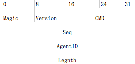

#Connect 部分协议定义
Connect定义采用文档的形式进行描述，会提供一份类PB的描述文件（比如用了pb不支持的uint16）。为何不直接使用pb。

pb支持的数据类型不够丰富（uint16），pb需要客户端引入一个pb的库，并且还有版本依赖关系。尤其对于iOS下面的
的.a静态库编译，可能与业务侧使用的pb出现重复定义的情况。

为了其他语言方便实现客户端逻辑，也提供了pb的序列化方案。

##1. FrameHead
FrameHead是每个数据包都有的，一个固定长度的数据帧头：

##2.SYN
发起连接的第一条协议就是SYN，SYN采用自定义协议，不依赖任何序列化工具。

	/** SYN **/
	message SYN {
	    uint32 seq
	    uint16 buffers
	    uint16 channel
	    uint16 crypto
	}

其中：
* seq：连接起始seq。
* buffers：后续的body部分采用什么序列化方式，仅限于connect流程
* channel：建立安全信道的方式，当前有None（不加密），Salt（RSA交换带有salt的key加密），DH（DH协商的加密key）。
* crypto: 加密方式，当前有AES128

##3.ACK
 
	/** ACK **/
	message ACK_None {
	    
	}
	
	message ACK_Salt {
	    uchar[16] pubkey
	    uchar[16] salt
	}
	
	message ACK_DH {
	
	}
	message ACK {
	    uint16 errno
	    uint16 channel
	    union {
	        ACK_None 
	        ACK_Salt
	        ACK_DH
	    }
	}
	
根据SYN请求时给的信道方式返回对应信道需要的信息。

##4.Session Request
建立回话的过程。

	/** Session Request **/
	message SessionReq {
	    uchar[16] key
	}
	
用于信道加密的key。

##5. Session Response

	/** Seesion Response **/
	message SeesionRsp {
	    uint16 errno
	    uint32 seesionid
	}

这里的sessionid实际上就是AgentID.

##6. Authrizone Request

鉴权请求

	/** Auth Request **/
	message AuthReq {
	    uint16 platform
	    uchar[32] accesskey
	    uchar[32] openid
	}
将鉴权平台以及该平台的openid、accesskey给到后台做验证

##7. Authrizone Response
	/** Auth Response **/
	message AuthRsp {
	    uint16 errno
	}
	
##8. Confirm
最后，服务器完成连接状态时，给客户端一个确认消息
	
	/** Confirm **/
	message Confirm {
	    uint16 errno
	}